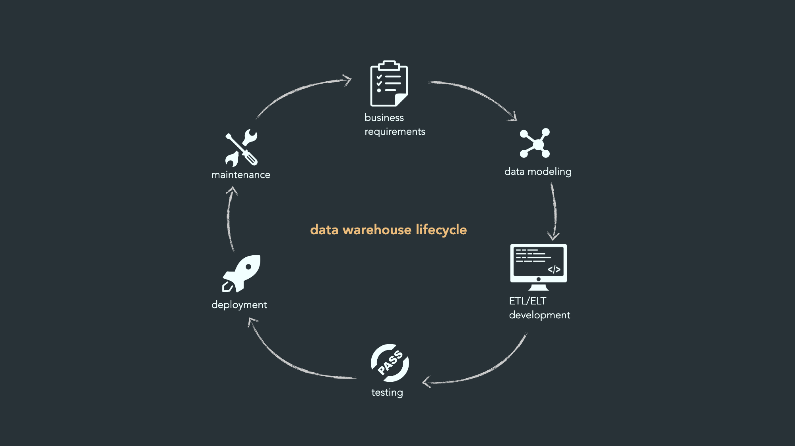

# Notes from the course

## 00. Course introduction

## Vad är ett datalager (data warehouse)?

- Ett system för att lagra och hantera data, främst för **business intelligence** och analys
- Innehåller ofta stora mängder **historisk data** (inte bara realtidsdata som en vanlig databas)
- Målet: skapa en "skattkista" av data som kan användas för att fatta bättre beslut

**Fyra grundkomponenter i ett datalager:**

1. **Data sources** – varifrån data kommer
2. **ETL** – Extract, Transform, Load (bearbetning av data)
3. **Data Warehouse** – själva lagret
4. **Data Marts** – mindre, avgränsade delar av lagret för specifika avdelningar/behov

## Bakgrund

- Data warehousing = strukturerat sätt att samla och organisera data för analys
- Från början sågs det som ett IT-projekt (mycket fokus på teknik)
- Idag: mer strategiskt kopplat till affärsmål → därav "lifecycle"-tänket

## Format

- Structured / Semistructured
  - csv, xslx , parquet, json
- Dofferend databaases
  - PostgreSQL, MySQL, SQL Server, MongoDB
- Untsructured text data
  - docz, pdf
- Other unstructured data
  - mp3, video, images

## De 8 faserna (Data Warehouse Lifecycle)

!

### 1. Business Requirements & Feasibility

- Ta reda på vad organisationen faktiskt behöver
- Prata med chefer, analytiker, dataansvariga
- Definiera krav på lagring, struktur, rapportering

### 2. Planning & Design

- Bygg övergripande arkitektur (datakällor, ETL, modell)
- Skapa datamodell – tre vanliga typer:
  - **Star Schema** – enkel, en central faktatabell + dimensioner
  - **Snowflake Schema** – som star schema men mer normaliserad (fler kopplade tabeller)
  - **Galaxy Schema** – flera faktatabeller som delar dimensioner
- Planera ETL-processer
- Sätt upp säkerhet & access-kontroll (vem får se/ändra vad, kryptering)

### 3. Data Acquisition

- **Extract** – hämta data från källor (databaser, API:er, filer)
- **Transform** – rensa och formatera data
- **Load** – ladda in i datalagret (batch eller realtid)

### 4. Testing & Validation

- **Unit testing** – testa enskilda delar (t.ex. en ETL-process)
- **Integration testing** – testa att delarna funkar ihop
- **UAT (User Acceptance Testing)** – slutanvändare testar och ger feedback

### 5. Deployment

- Datalagret går live (från test → produktion)
- Måste tåla verklig belastning
- Efter lansering: övervaka prestanda (query-tider, resursanvändning)

### 6. Documentation

- **Data dictionary** – förklarar vad varje datafält betyder
- **User guides** – hjälper slutanvändare att använda systemet
- **System documentation** – teknisk info för administratörer

### 7. Maintenance

- Datalager måste uppdateras löpande
- Ta bort gamla mätvärden, lägg till nya
- Justera ETL-processer vid behov

### 8. Retirement

- När datalagret blir omodernt/onödigt
- Arkivera data enligt regler (compliance, retention policies)
- Informera användare i god tid
- Dokumentera hela avvecklingsprocessen

## Exempel på verktyg

- **ETL-verktyg:** SAS Data Management, IBM Information Server, Hive
- **BI/rapportverktyg:** Tableau, Power BI

## Fördelar & nackdelar med DWLC (strukturerad livscykel)

**Fördelar**

- Tydlig, strukturerad process
- Hjälper till att identifiera rätt krav
- Minskar risk – problem upptäcks tidigt
- Högre datakvalitet

**Nackdelar**

- Tidskrävande process (kan ta månader/år)
- Kostsamt – kräver kompetent team
- Kräver specialistkunskap
- Mindre flexibelt vid ändringar

## Snabb minnesregel

> **Krav → Planera → Hämta data → Testa → Lansera → Dokumentera → Underhåll → Avveckla**
