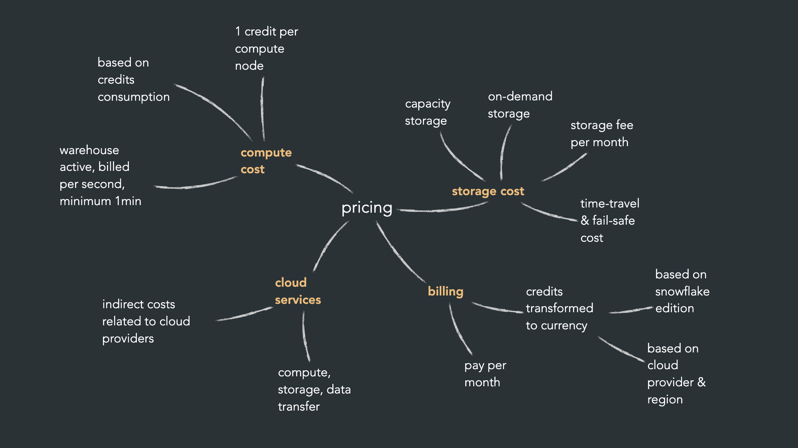

# SNOWFLAKE

# Snowflake Theory

## Snowflakes arkitektur (three-tier)

Snowflake bygger på tre separata lager som kan skalas oberoende av varandra:

- Cloud services – autentisering, access control, infrastruktur, optimering, metadata, säkerhet
- Compute – "virtual warehouses" som utför beräkningar
- Storage – där själva datan lagras

Snowflake körs ovanpå molnplattformar som AWS, Azure och Google Cloud.

## Pricing

Kostnaden bygger på tre delar:

- Compute cost – baserat på antal "credits", 1 credit per compute-nod, debiteras per sekund (minst 1 min)
- Storage cost – capacity storage, on-demand storage, samt time-travel/fail-safe-kostnader
- Cloud services – indirekta kostnader kopplade till molnleverantören

## Virtual warehouse – skalning

- Scaling up (vertikalt): byt till en större T-shirt-storlek (XS → S → M → L…), fler compute nodes → fler credits/timme. Bra för stora men få arbetsbelastningar.
- Scaling out (horisontellt): kör flera kluster av samma storlek parallellt, kan ställas in att skala automatiskt. Bra för många parallella arbetsbelastningar.

## Database och schema

Ett account kan innehålla flera databaser, och varje databas innehåller flera schemas som organiserar objekt som tabeller och vyer.

## Different types of Tables in Snowflake

## Connect to VSC

- Click on profile
- Account details
- copy url
- VSC - install extenstion Snowflake
- Sidepanel in VSC has Snowflake
- Put url in there
- sign in (fill in username)
- Click login (link opens in browser and login )
- Go back to vsc

## Change language to snowflake

- shift + command + p
- change language mode
- choose snowflake

# Snowflake navigation web UI

### Compute

- Warehouses - the warehouses that we have

### Sql file

- click on the + "sql file"
- write the sql querys directly in the UI
- works the same way as in vsc

### Databases

- catalog -> database explorer
- explore schemas, tables
- check data in data preview

## Monitoring

- in web snowflake
- Monitoring -> Query History

### Admin

- Cost Managment
- Billing and Payments

### Govarance & Secuity

- User & roles (create it here or sql)

### Marketplace

- Browse data
  - Click on get
- Sell data
